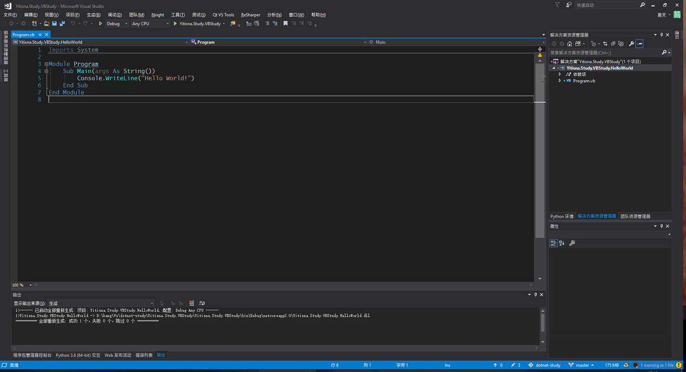

# Vb快速入门   

Basic语言的全名是Beginner’s All-purpose Symbolic Instruction Code（初学者通用的符号指令代码)，是几十年前流行过的一门语言。我高中时候一门数学选修课中使用的也是Basic语言。我还记得当时我为了使用Basic语言，还从网上下了一个简陋的QBasic工具。当时第一次接触编程的我对编程语言充满了兴趣。当然在现在，Basic语言已经基本没什么用了。现在还在使用的Basic语言大概就是微软的Visual Basic了。今天就来介绍一下Visual Basic语言。需要注意的是，VB语言运行在微软的CLR上，所以如果你对C#比较熟悉的话，学习VB就很简单了。

## **HelloWorld**

照例，第一个项目自然应该是HelloWorld。打开Visuall Studio，创建一个VB项目，然后就会出现如下图所示的代码。



来解释一下HelloWorld的代码。首先第一行是导入类库，和C#、java的import语句是一个道理。然后下面定义了一个Program模块，其中定义了Main函数，在函数中输出Hello World。在VB中，不使用大括号作为块分隔符，而是使用End语句来结束块作用域。

```VB
Imports System

Module Program
    Sub Main(args As String())
        Console.WriteLine("Hello World!")
    End Sub
End Module
1234567
```

## **基本数据类型**

由于VB和C#都是运行在CLR上的语言，所以其实它们的基本类型是一样的，都有有/无符号的各种长度整数、单精度双精度浮点数、布尔类型、字符和字符串等类型。下面的代码仅列出几个常用的。

```VB
Public Class DataType
    Sub DataType()
        Dim b As Byte
        Dim i As Integer
        Dim s As Single
        Dim d As Double
        Dim c As Char
        Dim str As String
        Dim bool As Boolean

        b = 100
        i = 1000
        s = 1.5
        d = 3.1415926
        c = "c"c
        str = "abc"
        bool = True
    End Sub
End Class
12345678910111213141516171819
```

## **变量和常量**

VB的变量定义也和C系语言不同，使用的是`Dim 变量名 As 变量类型`的语法进行定义。变量必须先定义才能使用。如果想同时定义多个变量，可以这么写。

```VB
Dim i, j As Integer
```

如果想在定义变量的同时初始化，可以这样。

```VB
Dim bool As Boolean = True
```

如果要定义常量，可以变量类似，只不过使用`Const`关键字。

```VB
Const cs As Integer = 1000
```

## 注释

1. 英文的一个点
2. Rem

```vbscript
'这里是个注释
Dim a 
rem 这里也是注释
```

## 大小写敏感性

无论是关键字还是变量名大小写都不敏感。

具体可以参考，[百度知道：vb区分大小写吗](https://zhidao.baidu.com/question/41209700.html)

## **运算符**

先来看看算术运算符。

| 运算符 | 用途     | 例子        |
| :----- | :------- | :---------- |
| ^      | 幂运算符 | 3 ^ 2 = 9   |
| +      | 加法     |             |
| -      | 减法     |             |
| *      | 乘法     |             |
| /      | 小数除法 | 3 / 2 = 1.5 |
| `\`    | 整除     | 3 `\` 2 = 1 |
| MOD    | 取模     | 6 MOD 4 = 2 |

然后是比较运算符。这里需要注意的就是VB的相等和不等和其他语言的可能不太一样。

| 运算符 | 用途   |
| :----- | :----- |
| =      | 相等   |
| <>     | 不等   |
| <      | 小于   |
| >      | 大于   |
| <=     | 不大于 |
| =      | 不小于 |

然后是逻辑运算符。

| 运算符  | 用途                 |
| :------ | :------------------- |
| And     | 与运算符，不短路求值 |
| Or      | 或运算符，不短路求值 |
| Not     | 非运算符             |
| Xor     | 异或运算符           |
| AndAlso | 与运算符，短路求值   |
| OrElse  | 或运算符，短路求值   |
| IsTrue  | 是否为真             |
| IsFalse | 是否为假             |

## **条件语句**

### If语句

先来看看VB中的If语句，其基本结构是`If 条件 Then 执行体 Else 执行体 End If`。

```VB
        Dim num As Integer = 5
        If num\2 = 0 Then
            Console.WriteLine($"{num} is even")
        Else
            Console.WriteLine($"{num} is odd")
        End If
123456
```

如果需要多重If语句，可以添加ElseIf语句块。

```VB
        If num = 1 Then
            Console.WriteLine($"{num} is 1")
        ElseIf num = 2
            Console.WriteLine($"{num} is 2")
        Else
            Console.WriteLine($"{num} is other")
        End If
1234567
```

### Select语句

Select语句相当于其他语言中的switch语句，如果没有匹配项，会执行Case Else语句块。

```VB
        Dim c As Char = "c"c
        Select c
            Case "a"c
                Console.WriteLine("a")
            Case "b"c, "c"c
                Console.WriteLine("b or c")
            Case Else
                Console.WriteLine("others")

        End Select
12345678910
```

## **循环语句**

### Do语句循环

Do语句循环有两种结构，第一种是循环条件在前。先来看看Do-While语句，当满足循环条件的时候会继续循环，不满足条件时跳出循环。这里顺便提一下，VB中没有块注释，只有单行注释，以单引号开头，直到句末。

```VB
        'Do While语句
        Dim i = 0
        Do While i < 5
            If i = 3 Then
                Exit Do
            End If
            Console.Write(i)
            i += 1
        Loop
123456789
```

再来看看Do-Until语句，和Do-While相反，在不满足条件的时候会执行循环，满足条件时跳出循环。

```VB
        'Do Until语句
        i = 0
        Do Until i > 5
            If i < 3 Then
                i += 2
                Continue Do
            End If
            Console.Write(i)
            i += 1
        Loop
12345678910
```

Do循环的第二种形式就是先执行循环体，然后进行判断，同样有While和Until两种。

```VB
        i = 0
        Do
            Console.Write(i)
            i += 1
        Loop While i < 5
        Console.WriteLine
123456
```

### While循环

还有就是传统的While循环。

```VB
        'While循环
        i = 0
        While i < 5
            Console.Write(i)
            i += 1
        End While
123456
```

### For循环

下面是For循环的例子，在For循环中可以使用Step指定步长。

```VB
        For counter As Integer = 1 To 9 Step 1
            Console.Write(counter)
        Next
123
```

### Foreach循环

Foreach循环用于迭代一个列表中的每一项。

```VB
        Dim array() as Integer = {1, 2, 3, 4, 5, 6, 7}
        For Each item As Integer In array
            Console.Write(item)
        Next
1234
```

### With语句

With语句其实不算循环语句，不过我看的这个VB教程把With语句放到这里说，那我也放到这里好了。With语句在有些语言中也有，主要用途是节省代码数量。比方说有下面这个Person类。

```VB
Public Class Person
    Public Property Name As String
    Public Property Age As Integer
End Class
1234
```

假如有一个person对象多次出现的话，就可以使用With语句，在With语句中，点访问符默认指向的就是With语句指定的对象。

```VB
        Dim person As Person = New Person
        With person
            .Name = "yitian"
            .Age = 25
            Console.WriteLine($"Person(Name:{.Name}, Age:{.Age})")
        End With
123456
```

## **跳转语句**

### Exit语句

Exit语句用于结束某个代码块，它的形式如下。想用Exit退出哪个代码块，就写哪个代码块的类型。

```VB
Exit { Do | For | Function | Property | Select | Sub | Try | While }
1
```

### Continue语句

Continue语句用于结束当前循环，直接进行下一次循环。它的形式如下，后面跟要继续的代码块类型。

```VB
Continue { Do | For | While }
1
```

### Goto语句

最后就是Goto语句，它会直接跳转到指定的标签处。

```VB
        'Goto语句
        GoTo Ending
        Console.WriteLine("Print something")
        Ending:
        Console.WriteLine("This is end.")
12345
```

## **数组**

先来看看数组定义。VB中的数组比较特殊，定义一个`Dim a1(3)`，其实是下标0-4长度为四的一维数组，这一点要非常注意。

```VB
        '下标0-9的十个元素的数组
        Dim array1(9) As Integer
        '11X11的二维数组
        Dim array2(2, 2) As Integer
        '定义并初始化数组
        Dim array3() = {1, 2, 3, 4, 5}
        '锯齿数组，也就是数组的数组
        Dim array4 As Integer()() = New Integer(1)() {}
        array4(0) = New Integer() {1, 2}
        array4(1) = New Integer() {3, 4}
12345678910
```

访问数组元素需要使用圆括号，而不是一般语言的方括号。

```VB
        '初始化一维数组
        For i As Integer = 0 To 9
            array1(i) = i
        Next

        '初始化二维数组
        For i = 0 To 2
            For j = 0 To 2
                array2(i, j) = (i + 1)*(j + 1)
            Next
        Next
1234567891011
```

最后就是遍历数组了，可以使用For循环迭代下标，或者用Foreach循环直接遍历元素。

```VB
        '显示数组
        For Each e In array1
            Console.Write(e)
        Next
        Console.WriteLine

        For i As Integer = 0 To 2
            For j = 0 To 2
                Console.Write(array2(i, j))
            Next
            Console.WriteLine
        Next

        For Each e In array3
            Console.Write(e)
        Next
        Console.WriteLine
        For i As Integer = 0 To 1
            For j = 0 To 1
                Console.Write(array4(i)(j))
            Next
            Console.WriteLine
        Next
1234567891011121314151617181920212223
```

## **函数**

### Sub函数

回头来看看前面的HelloWorld，其中就有一个Main函数，它是一个Sub函数，也就是没有返回值的函数。

```VB
Imports System

Module Program
    Sub Main(args As String())
        Console.WriteLine("Hello World!")
    End Sub
End Module
1234567
```

函数可以按值传参，也可以按引用传参，默认情况下是按值传参。

```VB
    Function GetParam(ByVal a As Integer, ByRef b As Integer)
        a = 10
        b = 10
        Console.WriteLine("Param changed")
    End Function
12345
```

### Function函数

Function函数就是有返回值的函数。在函数中，如果要返回值，可以有两种办法，第一种是使用Return语句，第二种是在函数体中向函数名赋值。

```VB
    '函数返回值可以用Return语句
    Function Return1() As Integer
        Return 1
    End Function

    '也可以向函数名赋值
    Function Return2() As Integer
        Return2 = 2
    End Function
123456789
```

### 可变参数列表

可变参数列表使用`ParamArray`声明。

```vb
    Function PrintIntegers(ParamArray integers As Integer())
        For Each i In integers
            Console.Write(i)
        Next
        Console.WriteLine
    End Function
123456
```

## **面向对象编程**

### 类

VB的类和C#的类非常相似，同样有字段、属性等概念。构造函数使用New声明，不需要返回值。析构函数使用Finalize声明，也不需要返回值。

```vb
Class Contact
    ' 字段
    Private _name As String
    Private _tel As String

    '构造函数
    Public Sub New(name As String, tel As String)
        _name = name
        _tel = tel
    End Sub

    '析构函数
    Protected Overrides Sub Finalize()
    End Sub

    '属性
    Public Property Tel As String
        Get
            Return _tel
        End Get
        Set
            _tel = value
        End Set
    End Property

    Public Property Name As String
        Get
            Return _name
        End Get
        Set(value As String)
            _name = value
        End Set
    End Property

    '重写方法
    Public Overrides Function ToString() As String
        Return $"Contact(Name:{Name}, Tel:{Tel})"
    End Function
End Class
123456789101112131415161718192021222324252627282930313233343536373839
```

### 抽象类和接口

如果一个类的方法含有MustOverride修饰符，那么这个方法就是一个抽象方法。含有抽象方法的类就是抽象类，需要使用MustInherit关键字修饰。

```vb
MustInherit Class Shape
    MustOverride Function GetArea() As Double
End Class

Interface Color
    Function GetColor() As String
End Interface
1234567
```

### 继承

继承基类和实现接口的声明必须写在类实现的前面。如果一个方法重写了基类的版本，那么这个方法应该使用Overrides关键字修饰。如果不希望类被其他类继承，可以使用NotInheritable修饰，类似于Java的final关键字或者C#的sealed关键字。如果子类需要调用基类的方法，可以使用MyBase关键字代表基类。

```vb
Class Circle
    Inherits Shape
    Protected radius As Double

    Public Sub New(r As Double)
        radius = r
    End Sub

    Public Overrides Function GetArea() As Double
        Return Math.PI*radius*radius
    End Function
End Class

NotInheritable Class RedCircle
    Inherits Circle
    Implements Color

    Public Sub New(r As Double)
        MyBase.New(r)
    End Sub

    Public Function Color_GetColor() As String Implements Color.GetColor
        Return "Red"
    End Function
End Class
12345678910111213141516171819202122232425
```

### 静态成员

静态成员和静态函数使用Shared关键字声明，对于每个类来说Shared成员只会存在一个。

```vb
Class MyMath
    Public Shared PI As Double = 3.1415926

    Public Shared Function GetPI As Double
        Return PI
    End Function
End Class
1234567
```

### 模块

Module类似于Class，不同之处在于Module不需要实例化，其中的函数可以直接调用，就像静态函数一样。

```vb
Module Program
    Sub Main(args As String())
        Console.WriteLine("Hello World!")
    End Sub
End Module
12345
```

## **异常处理**

### try catch 

VB的异常处理和C#的一样，都有Try、Catch、Finally部分。

```vbscript
Public Module ExceptionHandling
    Sub HandleException()
        Try
            Throw New ArithmeticException("除数不能为零")
        Catch ex As ArithmeticException
            Console.WriteLine($"捕获了数学计算异常:{ex.Message}")
        Catch ex As Exception
            Console.WriteLine($"捕获了异常:{ex.Message}")
        Finally

            Console.WriteLine("终结代码")
        End Try
    End Sub
End Module
```

### On Error Resume Next

有的时候，不能用Try catch语法，比如在wincc中，就不可以，这个时候，可以试下 on error resume next语法

```vbscript
On Error Resume Next

'这里是操作1
DoStep1

'如果这个不等于0，就是有错误
If Err.Number <> 0 Then
  WScript.Echo "Error in DoStep1: " & Err.Description
  Err.Clear
End If


'这里是操作1
DoStep2

If Err.Number <> 0 Then
  WScript.Echo "Error in DoStop2:" & Err.Description
  Err.Clear
End If

'If you no longer want to continue following an error after that block's completed,
'call this.
On Error Goto 0
```

以上就是VB语言的一些介绍了，希望对大家能有所帮助。

